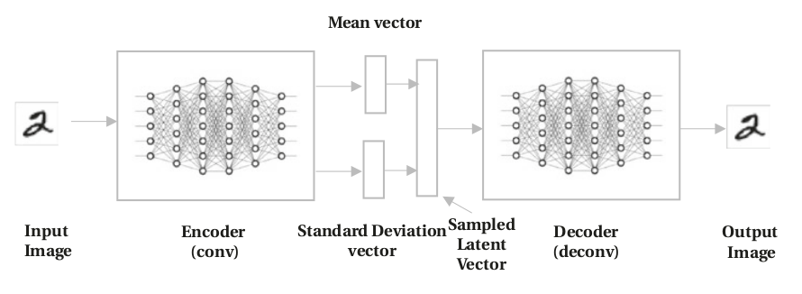

# Autoencoders

Autoencoders are a type of ANN that is used to generate output data in the same unsupervised manner as for input data.

### Parts:
#### Encoder
The encoder compresses the input data into a lower dimensional representation of it.

#### Decoder
The decoder decompresses the representation into the original input data.

## Applications:
One limitation of autoencoders is that they can only be used to reconstruct
data that the encoder part of the autoencoders has seen during the
training.
They cannot be used to generate new data.

1. As a dimensionality reduction technique to observe/visualize high-dimensional data into lower dimensions.
2. As a compression technique to save memory and network cost.

## Variational autoencoders:
A VAE is a type of generative model plus general autoencoders that let us sample from the model, to generate data.

VAEs force the compressed representation of the input data to follow a zero mean and a unit variance Gaussian distribution.

